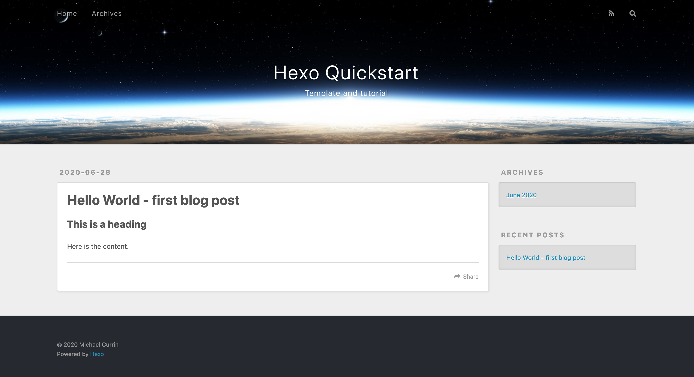

# Hexo Quickstart
> The easy way to start create a new Hexo blog

## Preview

    

## Use this project

## About this template

### What is Hexo?

[Hexo](https://hexo.io) is a static-site generator which can be installed as an NPM package. 

This project helps you start a new Hexo site. This template is based on an outline that was generated by running `hexo init`. You can also use this as a reference how on a basic Hexo project works.

Learn more about Hexo basics and find external resources in the [docs](https://github.com/MichaelCurrin/hexo-quickstart/tree/master/docs#readme) of this project.

This project includes a [CI Deploy](/docs/deploy.md#ci-deploy) flow using GitHub Actions to automatically deploy to [GitHub Pages](https://pages.github.com/) for you on a commit or push.

### How to use this project

1. Read the [docs](/docs/) for some info on Hexo.
1. Click _Use this template_ button add the repo to your own repos.
1. Follow the [docs](/docs/) to set it up locally and/or remotely on GH Pages.
1. Customize the project. 
    - Add your own pages and posts to [source](/source). Copy and existing page or using the CLI locally to make use of the [scaffolds](/scaffolds) for new pages.
    - Update the [\_config.yml](/_config.yml) file's _Menu_ section to setup your navbar.
    - Choose your own theme and styling.
1. Customize the docs directory.
1. Delete the _About this template_ section.

## Documentation

See the [docs](/docs/) directory.

## License

Released under [MIT](/LICENSE).
